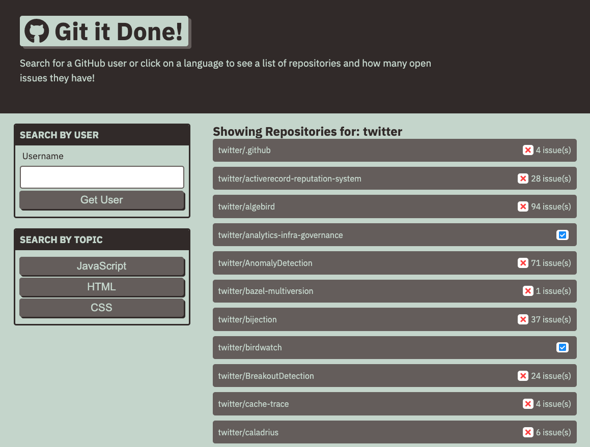

# git-it-done

## Purpose

A web app that will search GitHub for open source projects with open issues and pull requests.

## Build With

- HTML
- CSS
- JavaScript
- jQuery
- Bootstrap

## Server Side APIs

- GitHub User API: https://api.github.com/users
- GitHub Search API: https://api.github.com/search/repositories

### Launch Git It Done App

https://joce1ynn.github.io/git-it-done-API/

## Website Screenshot

## Contribution

Made by Wenwen Tian
